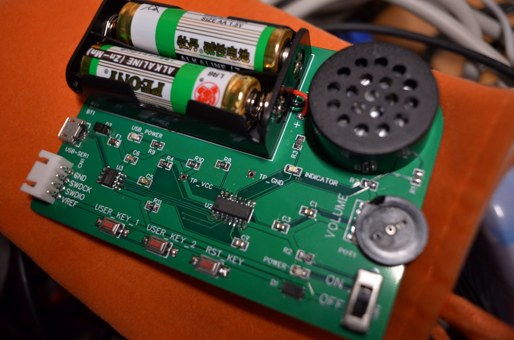

# Intro

This is a wavetable synthesis based music-box. 



# Build Firmware

The firmware can be compiled with [arm-none-eabi-gcc](https://developer.arm.com/tools-and-software/open-source-software/developer-tools/gnu-toolchain/gnu-rm/downloads). Build system is based on Makefile. So run 

```
make
```

in the root directory can handle all the things.

# Download Score Data

```
python  download.py scoreList.raw
```

The pyserial and python3 is required. The "scoreList.raw" is the file generated by [midi-to-hex tool](https://github.com/eeyrw/midi-to-hex/tree/new-midi-to-hex).